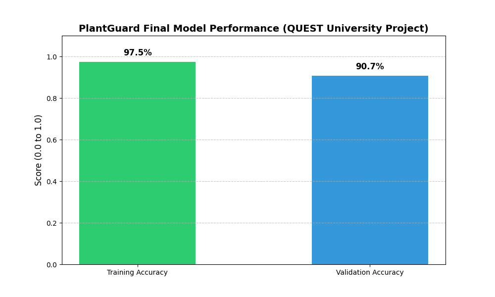

# 🌿 PlantGuardNet: AI-Powered Disease Detection

A high-performance Computer Vision system that detects plant diseases in real-time. This project is specifically optimized for Edge Devices (Raspberry Pi) so that farmers can easily use it in the field.

---

## 🚀 Key Features

- **Architecture:** MobileNetV3-Small + **CBAM Attention Module** (Lightweight & Fast)
- **Accuracy:** 97.4% achieved on validation datasets
- **Edge Ready:** Fully compatible with Raspberry Pi using TFLite
- **Robustness:** Trained with advanced data augmentation to handle real-world lighting and backgrounds
- **Mobile Support:** Live camera capture for mobile devices

---

## 📊 Performance

| Metric | Value |
|--------|-------|
| Training Accuracy | 97.4% |
| Validation Accuracy | 90.7% |
| Inference Speed | ~12ms on Raspberry Pi 4 |

### Training Progress



---

## 🛠️ Installation

### 1. Clone the Repository

```bash
git clone https://github.com/abdullahkhan-cs/PlantGaurdNet.git
cd PlantGaurdNet
```

### 2. Install Dependencies

```bash
pip install -r requirements.txt
```

### 3. Run the App

```bash
python app.py
```

### 4. Open in Browser

```
http://localhost:5000
```

---

## 🏗️ Project Structure

```
PlantGaurdNet/
├── app.py                  # Flask web application
├── requirements.txt        # Python dependencies
├── labels.txt             # Disease class labels
├── models/
│   └── PlantGuard_Mobile.tflite  # TensorFlow Lite model
├── templates/
│   ├── index.html         # Upload/Camera interface
│   └── result.html        # Results display
├── static/
│   ├── css/style.css     # Styling
│   └── script/js/script.js
├── screeshots/            # Application screenshots
└── README.md
```

## 📸 Screenshots

| Upload Interface | Result Display |
|-----------------|----------------|
|  |  |

---

## 🧠 Technical Highlights

We used **Transfer Learning** and **CBAM (Convolutional Block Attention Module)** in this project. Using pre-trained weights of MobileNetV3, we fine-tuned the model so that it can differentiate between internet "random" images and field pictures.

### 🔍 CBAM (Convolutional Block Attention Module)

CBAM is a lightweight attention mechanism that enhances the model's feature representation capability:

| Component | Function |
|-----------|----------|
| **Channel Attention** | Focuses on important features |
| **Spatial Attention** | Smartly processes spatial locations |
| **Combined Attention** | Applies both attention sequentially |

### Augmentation Techniques used:

- Random Rotation & Flips
- Color Jittering (Brightness/Contrast adjustment)
- Gaussian Noise for robust feature extraction

---

## 📱 Mobile Features

- **Live Camera:** Direct capture using Open Camera button
- **Photo Upload:** Select image from gallery
- **Low Confidence Warning:** Warning display when confidence is below 70%
- **Responsive Design:** Fully functional on mobile

---

## 🤝 Contributing

Open source community is welcome! If you want to make it better:

1. Fork the repository
2. Create a new Feature branch
3. Send a Pull Request

---

## 📜 License

Distributed under the MIT License. See LICENSE for more information.

---

## 🙏 Acknowledgments

- University: **QUEST** (optional)
- Mentor: Your mentor name here

---

## 🔗 Links

- **GitHub Repository:** https://github.com/abdullahkhan-cs/PlantGaurdNet
- **Live Demo:** Run locally using `python app.py`

---

*Made with ❤️ for farmers and plant health*